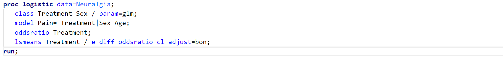
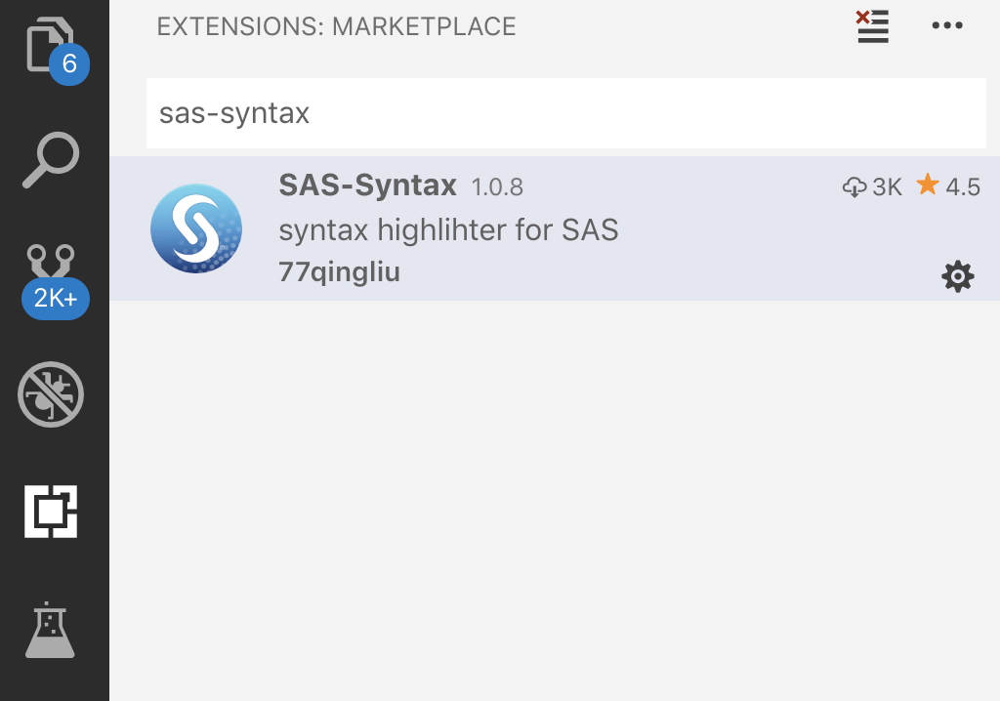

# SAS Language Definition for VSCode

 Syntax highlighting for the SAS files in VsCode, with precise syntax match, SAS like theme and code snippets. 
 The syntax highlighting uses tmLanguage files sourced from https://raw.githubusercontent.com/martinring/tmlanguage/master/tmlanguage.json. 

## Features
#### Data Step

#### Proc SQL

#### Inside Macro

#### Statistical Procedure

## Install instructions
* **Install the extension**
  * Search **sas-syntax** in the extension market
  * 
* **Extension settings**

  Firstly, change syntax engine to SAS
  * toggle `CTRL+SHIFT+P` to open the command panel
  * enter `change language mode`
  * select SAS
  

  Secondly, change theme to SAS
  * toggle `CTRL+SHIFT+P` to open the command panel
  * enter `color theme`
  * select SAS
  

## Known Issues
Syntax parse error if there are unmatched `'` or `"` even if being marked by macro mask

## For more information

**Enjoy!**
