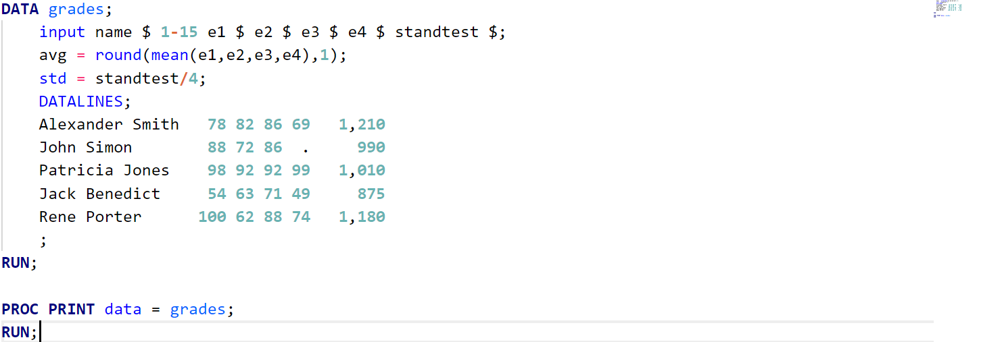
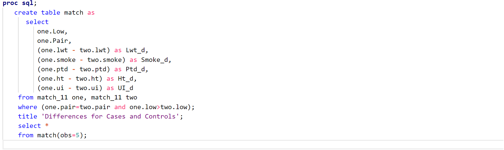
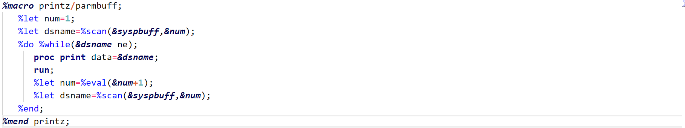
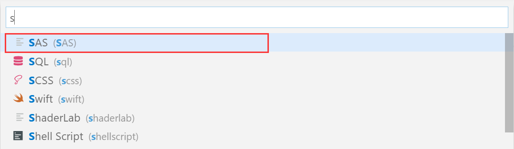
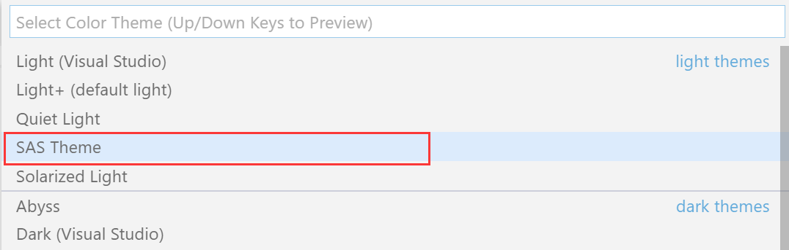
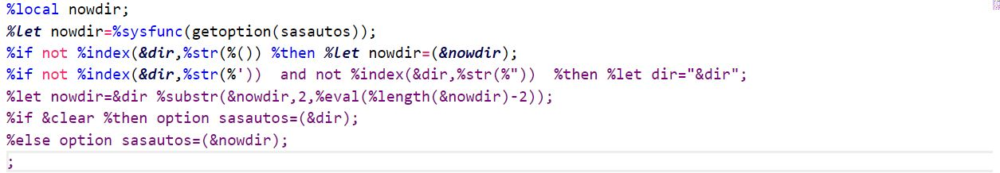

# SAS Language Definition for VSCode

 Syntax highlighting for the SAS files in VsCode, with precise syntax match, SAS like theme and code snippets. 
 The syntax highlighting uses tmLanguage files sourced from https://raw.githubusercontent.com/martinring/tmlanguage/master/tmlanguage.json. 

## Features
* Data Step

* Proc SQL

* Inside Macro

## Extension Settings
Firstly, change syntax engine to SAS
* toggle `CTRL+SHIFT+P` to open the command panel
* enter `change language mode`
* select SAS

Secondly, change theme to SAS
* toggle `CTRL+SHIFT+P` to open the command panel
* enter `color theme`
* select SAS

## Known Issues
Syntax parse error if there are unmatched `'` or `"` even if being marked by macro mask

## For more information

**Enjoy!**

## TO-DO
- [ ] Add code snippets
- [ ] More proc grammer into syntax and the corresponding snippets
    - [x] CATALOG
    - [x] CONTENTS
    - [x] DATASETS
    - [x] EXPORT
    - [x] IMPORT
    - [ ] SGPLOT
    - [ ] TEMPLATE
    - [x] PRINT
    - [x] RANK
    - [x] FREQ
    - [x] CORR
    - [ ] UNIVARIATE
    - [ ] ANOVA
    - [ ] CLUSTER
    - [ ] FACTOR
    - [ ] REG
    - [ ] SURVEYSELECT
    - [ ] LOGISTIC
    - [ ] LIFETEST
    - [X] TRANSPOSE
    - [ ] ANOVA 
    - [ ] APPEND 
    - [ ] CPORT
    - [ ] FASTCLUS
    - [ ] GLM
    - [ ] MIXED
    - [ ] NPAR1WAY
    - [ ] TTEST